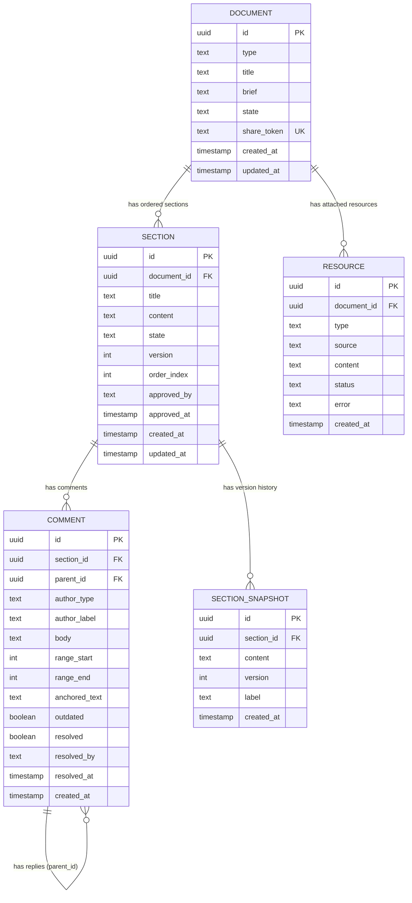

# Entity Relationship Diagram

All product and engineering decisions captured here. V1 = building now. V2 = decided, deferred.

---

## Diagram



---

## Entity Definitions

### DOCUMENT

Represents one collaborative document from creation to final approval.

| Column | Type | Constraints | V1/V2 | Notes |
|---|---|---|---|---|
| `id` | UUID | PK, default gen_random_uuid() | V1 | |
| `type` | TEXT | NOT NULL | V1 | See enum below |
| `title` | TEXT | NOT NULL | V1 | User-provided or derived from brief |
| `brief` | TEXT | NOT NULL | V1 | Full brief text from setup step |
| `state` | TEXT | NOT NULL, default 'SETUP' | V1 | See state machine below |
| `share_token` | TEXT | UNIQUE, NOT NULL | V1 | Random token — only access mechanism (no auth) |
| `created_at` | TIMESTAMPTZ | default NOW() | V1 | |
| `updated_at` | TIMESTAMPTZ | default NOW() | V1 | Updated on any state change |

**`type` enum:**
```
tech_design_doc | product_spec | security_review | plan | custom
```

**`state` machine:**
```
SETUP
  → user fills brief, uploads resources, generates outline
  → "Start Writing" clicked → GENERATING

GENERATING
  → AI Author writing sections, AI Critic reviewing completed sections
  → all sections written → IN_REVIEW
  → interrupt triggered → INTERRUPTED

IN_REVIEW
  → humans reviewing, requesting revisions, approving sections
  → all sections APPROVED → APPROVED
  → interrupt triggered → INTERRUPTED

INTERRUPTED
  → all AI stopped, approved sections preserved
  → "Resume Writing" clicked → GENERATING (from first unfinished section)

APPROVED
  → all sections individually approved, document-level approve clicked
  → "Reopen" on any section → IN_REVIEW
```

---

### SECTION

One section within a document. AI Author writes into it. AI Critic and humans comment. State machine governs who can do what.

| Column | Type | Constraints | V1/V2 | Notes |
|---|---|---|---|---|
| `id` | UUID | PK, default gen_random_uuid() | V1 | |
| `document_id` | UUID | FK → document.id, ON DELETE CASCADE, NOT NULL | V1 | |
| `title` | TEXT | NOT NULL | V1 | From confirmed outline |
| `content` | TEXT | NULL until Author writes | V1 | NULL = NOT_STARTED |
| `state` | TEXT | NOT NULL, default 'NOT_STARTED' | V1 | See state machine below |
| `version` | INTEGER | NOT NULL, default 0 | V1 | **Optimistic locking.** Incremented on every accepted human edit. Write must include expected version — rejected if mismatch. |
| `order_index` | INTEGER | NOT NULL | V1 | Display order within document |
| `approved_by` | TEXT | NULL | V1 | Label of first human to approve (e.g. '@alice'). No user table — auth is out of scope. |
| `approved_at` | TIMESTAMPTZ | NULL | V1 | |
| `created_at` | TIMESTAMPTZ | default NOW() | V1 | |
| `updated_at` | TIMESTAMPTZ | default NOW() | V1 | |

**`state` machine:**
```
NOT_STARTED
  → Author begins writing → DRAFT

DRAFT  [locked for editing]
  → AI Author streaming content (server-side accumulation, not shown to client)
  → UI shows progress indicator + [Preview] + [Cancel/Interrupt]
  → Comments allowed (queued), text editing not allowed
  → Author finishes → OPEN
  → Document-level interrupt → NOT_STARTED (content discarded)

OPEN  [fully editable]
  → AI Critic reviewing (may still be adding comments)
  → Humans can: comment, edit text (direct replace, optimistic lock), reply to comments
  → "Request Revision" clicked → QUEUED_FOR_REVISION or REVISING
  → "Approve" clicked → APPROVED (first human to click wins)

QUEUED_FOR_REVISION
  → Revision requested but Author is finishing another section
  → Comments still allowed
  → Author becomes available → REVISING

REVISING  [locked for editing]
  → Author rewriting with: latest text + all comments + human steering
  → Author receives clean text only (no markup), plus comments as context bundle
  → Same rules as DRAFT (progress indicator, comments queued)
  → Author finishes → OPEN (Critic re-reviews automatically)
  → Document-level interrupt → OPEN (revision discarded, section returns to pre-revision state)

APPROVED  [fully locked]
  → Read-only: no comments, no edits, no revisions
  → "Reopen" → OPEN (approved text becomes new baseline)

DRAFT_ERROR
  → Author failed after all BullMQ retries exhausted
  → UI shows error + manual retry option
  → Retry → DRAFT
```

**Optimistic lock pattern (atomic, single query):**
```sql
UPDATE sections
SET content = $1, version = version + 1, updated_at = NOW()
WHERE id = $2 AND version = $3
RETURNING version;
-- No row returned = version mismatch → reject, emit edit.rejected to client
-- Row returned = accepted → emit edit.accepted to room
```

---

### COMMENT

Comments from humans or AI Critic on a section. Self-referential for threaded replies.

| Column | Type | Constraints | V1/V2 | Notes |
|---|---|---|---|---|
| `id` | UUID | PK, default gen_random_uuid() | V1 | |
| `section_id` | UUID | FK → section.id, ON DELETE CASCADE, NOT NULL | V1 | |
| `parent_id` | UUID | FK → comment.id, NULL | V1 | NULL = top-level comment. Non-null = reply to parent. |
| `author_type` | TEXT | NOT NULL | V1 | `human` or `ai_critic` |
| `author_label` | TEXT | NOT NULL | V1 | `@alice`, `[AI Critic]`. Stored as text — no user table. |
| `body` | TEXT | NOT NULL | V1 | Comment content |
| `range_start` | INTEGER | NULL | **V2** | Character offset in section content where comment starts |
| `range_end` | INTEGER | NULL | **V2** | Character offset where comment ends |
| `anchored_text` | TEXT | NULL | **V2** | Snapshot of text at time of comment. Used to detect outdated state: if section text at [range_start:range_end] no longer matches anchored_text → mark outdated. |
| `outdated` | BOOLEAN | NOT NULL, default FALSE | **V2** | Set TRUE when anchored text is edited. Shows "Outdated" badge (like GitHub PR comments). |
| `resolved` | BOOLEAN | NOT NULL, default FALSE | V1 | |
| `resolved_by` | TEXT | NULL | V1 | Label of human who resolved |
| `resolved_at` | TIMESTAMPTZ | NULL | V1 | |
| `created_at` | TIMESTAMPTZ | default NOW() | V1 | |

**V1 behaviour:** Comments are section-level (range_start/range_end/anchored_text all NULL). Thread appears in sidebar per section.

**V2 behaviour:** Inline text-range comments. User highlights text → comment anchored to that range. On any edit overlapping range → `outdated = true`. Comment floats with "Outdated" badge showing original anchored_text. Same pattern as GitHub PR comments on edited lines.

**Constraints:**
```sql
CONSTRAINT range_both_or_neither
  CHECK ((range_start IS NULL) = (range_end IS NULL))
-- Both must be set or both must be NULL
```

**AI Author context on Request Revision:**
- Author receives: clean latest section text (no markup) + all unresolved comments (human + AI Critic) registered at the moment button clicked
- Priority in prompt: human comments > human replies to Critic comments > Critic comments with no reply
- Comments fed as structured context, NOT as text markup

---

### SECTION_SNAPSHOT

Immutable record of section content at the start of each revision cycle. Audit trail.

| Column | Type | Constraints | V1/V2 | Notes |
|---|---|---|---|---|
| `id` | UUID | PK, default gen_random_uuid() | V1 | |
| `section_id` | UUID | FK → section.id, ON DELETE CASCADE, NOT NULL | V1 | |
| `content` | TEXT | NOT NULL | V1 | Full section text at time of snapshot |
| `version` | INTEGER | NOT NULL | V1 | Section version at time of snapshot |
| `label` | TEXT | NOT NULL | V1 | `initial_draft`, `revision_1`, `revision_2`, … |
| `created_at` | TIMESTAMPTZ | default NOW() | V1 | |

**When created:** At the start of every REVISING transition — captures the content the Author is about to replace. Enables version history UI (V2).

---

### RESOURCE

Files and links attached to the document brief for AI Author context.

| Column | Type | Constraints | V1/V2 | Notes |
|---|---|---|---|---|
| `id` | UUID | PK, default gen_random_uuid() | V1 | |
| `document_id` | UUID | FK → document.id, ON DELETE CASCADE, NOT NULL | V1 | |
| `type` | TEXT | NOT NULL | V1/V2 | See enum below |
| `source` | TEXT | NOT NULL | V1 | Original URL, filename, or ticket ID |
| `content` | TEXT | NULL until fetched | V1 | Extracted text content. Capped at 500KB — larger content truncated with warning. |
| `status` | TEXT | NOT NULL, default 'pending' | V1 | See enum below |
| `error` | TEXT | NULL | V1 | Error message if status = 'failed' |
| `created_at` | TIMESTAMPTZ | default NOW() | V1 | |

**`type` enum:**
```
file       → V1: uploaded file (PDF, .md, .txt, .docx parsed to text)
url        → V2: web URL fetched via tool call
jira       → V2: Jira ticket fetched via Jira API
confluence → V2: Confluence page fetched via API
```

**`status` enum:**
```
pending  → not yet fetched
fetched  → content available
failed   → fetch failed (error column has detail)
skipped  → human explicitly skipped this resource (can proceed without it)
```

**V1 scope:** Only `file` type supported. Human uploads file in brief setup, content extracted server-side. URL fetching and integrations are V2.

**Fetch flow (V2 preview):** Resource fetcher runs before outline generation. All resources must be `fetched` or `skipped` before "Create Document" button unlocks. Failed resources show `[Fix URL] [Re-upload] [Skip]` options.

---

## Indexes

```sql
-- Document lookup by share token (every page load)
CREATE UNIQUE INDEX idx_documents_share_token ON documents(share_token);

-- Sections ordered within a document
CREATE INDEX idx_sections_document_id ON sections(document_id, order_index);

-- Comments for a section, chronological
CREATE INDEX idx_comments_section_id ON comments(section_id, created_at);

-- Comment replies
CREATE INDEX idx_comments_parent_id ON comments(parent_id)
  WHERE parent_id IS NOT NULL;

-- Snapshot history for a section
CREATE INDEX idx_snapshots_section_id ON section_snapshots(section_id, version);

-- Resources for a document
CREATE INDEX idx_resources_document_id ON resources(document_id);
```

---

## Non-Database Components

These are part of the system architecture but not in Postgres.

### Redis (BullMQ job queues)

Three named queues = three partitions. Workers bind to their queue.

```
Queue: author
  Job payload:  { documentId, sectionId, isRevision: boolean }
  Concurrency:  3 (3 sections authored in parallel across all docs)
  Retries:      3 attempts, exponential backoff (2s → 4s → 8s)
  On failure:   section.state → DRAFT_ERROR, emit error event to room

Queue: critic
  Job payload:  { documentId, sectionId }
  Concurrency:  10
  Retries:      3 attempts, exponential backoff

Queue: resource-fetch   [V2]
  Job payload:  { documentId, resourceId }
  Concurrency:  20
  Retries:      3 attempts
```

**Author context bundle (assembled by worker at execution time from Postgres):**
```
- document.brief
- resources (status = 'fetched')
- sections ordered by order_index with content (all prior written sections)
- if isRevision=true: all unresolved comments on this section (priority-ordered)
```

**Critic context bundle:**
```
- document.type + document.brief
- section.title + section.content
- prior comments on this section from previous revision cycles
```

### Redis (AP read cache — V2 optimization)

V1 reads directly from Postgres. Redis cache added in V2 to buffer reads from primary during partial outage.

```
Key: section:{id}:content    → TEXT, TTL 24h
Key: section:{id}:comments   → JSON list, TTL 24h, invalidated on new comment
Key: document:{id}:meta      → JSON, TTL 1h
```

### Socket.io Rooms

One room per document. All clients viewing the same document join `document:{id}`.

```
Events server → all clients in room:
  section.generationStarted   { sectionId }
  section.contentReady        { sectionId, text, newState: 'OPEN' }
  section.criticStarted       { sectionId }
  section.stateChanged        { sectionId, newState }
  comment.added               { sectionId, comment }
  comment.resolved            { commentId }
  edit.accepted               { sectionId, text, version }
  section.approved            { sectionId, approvedBy, timestamp }
  cursor.update               { userId, sectionId, position }   [V2]

Events server → single client only:
  edit.rejected               { sectionId, currentText, currentVersion, editedBy }
  approve.failed              { sectionId, approvedBy }
  revision.failed             { sectionId, reason }
  document.state              { ...full document snapshot }      (on sync/reconnect)
  section.preview             { sectionId, partialText }        (on preview request)
```

---

## V1 Build Scope Summary

| Entity / Feature | V1 | V2 | Notes |
|---|---|---|---|
| Document CRUD | ✅ | | |
| Section state machine (all 7 states) | ✅ | | |
| AI Author via BullMQ | ✅ | | |
| AI Critic via BullMQ | ✅ | | |
| Section-level comments (human + AI Critic) | ✅ | | |
| Comment threads (replies) | ✅ | | |
| Request Revision (explicit trigger) | ✅ | | |
| Section approval (first wins) | ✅ | | |
| Document-level approval | ✅ | | |
| Optimistic locking (version column) | ✅ | | |
| Section snapshots (audit trail) | ✅ | | |
| Progress indicator during DRAFT/REVISING | ✅ | | |
| Share-link access (no auth) | ✅ | | |
| Document interrupt & restart | ✅ | | |
| Predefined outlines (4 types + custom) | ✅ | | |
| File upload as resource | ✅ | | |
| Socket.io real-time (state, comments, edits) | ✅ | | |
| Inline text-range comments + outdated detection | | ✅ | range_start/range_end/anchored_text columns exist, unused in V1 |
| URL/Jira/Confluence resource fetching | | ✅ | resource.type='url/jira/confluence' |
| Cursor presence | | ✅ | Socket.io cursor.update event defined, not emitted in V1 |
| Redis AP read cache | | ✅ | V1 reads from Postgres directly |
| Version history UI (browse snapshots) | | ✅ | Snapshots are stored in V1, UI is V2 |
| Human-authored mode (write yourself, AI reviews) | | ✅ | |
| Suggest mode / Track Changes | | ✅ | Dropped — direct replace is V1 |
| Document export (PDF, Notion, Google Docs) | | ✅ | |
| Auth / permissions / roles | | ✅ | Link-based only, forever optional |
